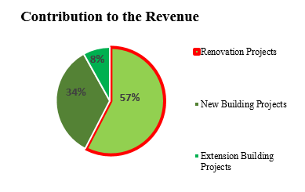
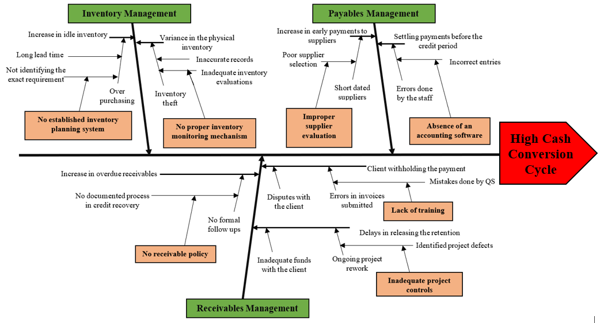
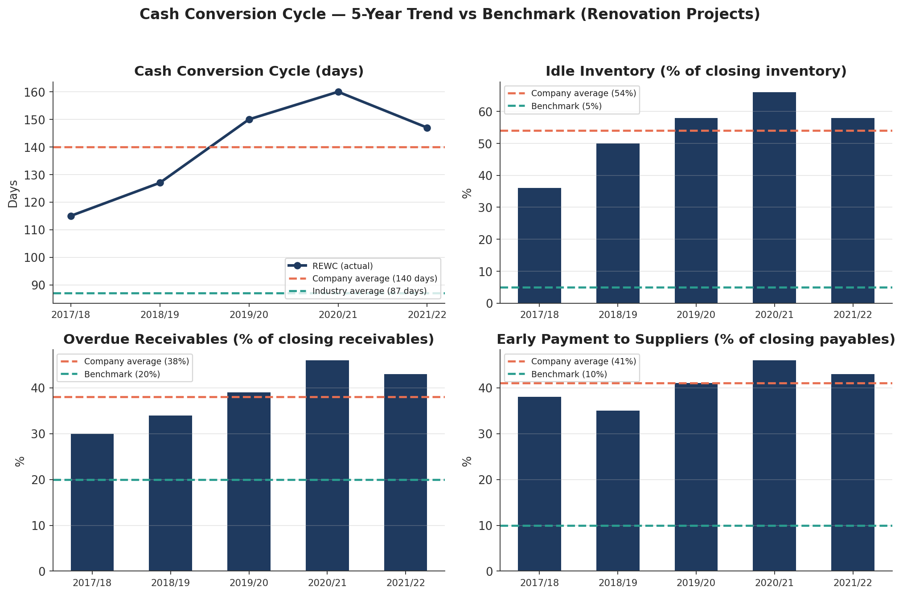
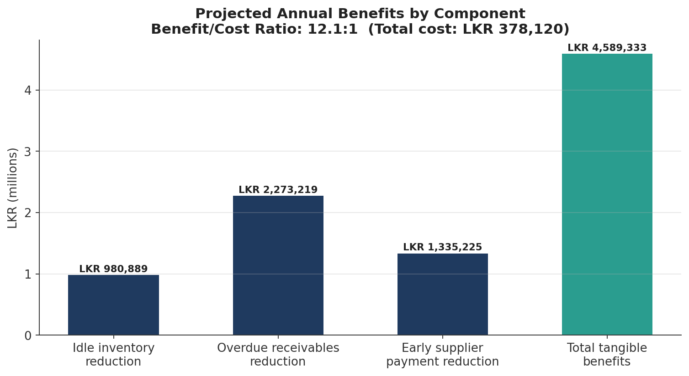

# Reducing Cash Conversion Cycle in Renovation Projects - R.E.W. Constructions (Pvt) Ltd.

Management Field Research Project completed as part of the **Master of Business Administration, Postgraduate Institute of Management (PIM), University of Sri Jayewardenepura**. Unlike the virtual-experience case studies elsewhere in this portfolio, this was a real engagement: field interviews, company financial data and process analysis conducted directly with R.E. Weerakoon Constructions (REWC), a Sri Lankan construction SME, over 2022–2023. The full 90-page report is included in this repo; this README summarises the analysis, findings and recommended solutions.

## The problem

REWC undertakes new-build, extension and renovation projects for government, semi-government and private clients. Renovation projects are the smallest in scope but the largest revenue driver and the most cash-constrained.

  

**Renovation projects at REWC have a Cash Conversion Cycle (CCC) of 140 days - 38% higher than the 87-day industry benchmark** (Access Engineering PLC, used as a comparable given limited public reporting from construction peers). That gap ties up cash that should be funding operations, and it has been persistent for five straight years.

## Root cause analysis

Interviews with the site engineer, finance manager and procurement executive identified three associated problems - idle inventory, overdue receivables, and early payment to suppliers and seven underlying root causes, mapped in a fishbone diagram:

  

## The numbers behind the problem

Five years of company data (FY2017/18–2021/22) against company benchmarks and the industry average:

  

| Driver | Company average | Benchmark | Gap |
|---|---|---|---|
| Cash Conversion Cycle | 140 days | 87 days (industry) | 38% |
| Idle inventory (% of closing stock) | 54% | 5% (company target) | 90% |
| Overdue receivables (% of closing receivables) | 38% | 20% (company target) | 47% |
| Early payment to suppliers (% of closing payables) | 41% | 10% (company target) | 76% |

## Proposed solutions

Solutions were developed for each of the three project components, each addressing a specific root cause identified above:

- **Inventory management** - a formal inventory planning and monitoring process, a daily project report format, and a store policy to close the gap between purchasing and actual site demand.
- **Receivables management** - a documented receivable policy, a training needs plan for quantity surveyors (to reduce invoice errors that delay client payment), and a quality plan to cut disputes and rework.
- **Payables management** - a redesigned supplier evaluation process and criteria, and supplier relationship management guidelines, so REWC isn't defaulting to short-credit suppliers.

## Projected impact

  

| Item | Value (LKR) |
|---|---|
| Reduced idle inventory | 980,889 |
| Reduced overdue receivables | 2,273,219 |
| Reduced early supplier payment | 1,335,225 |
| **Total tangible benefits** | **4,589,333** |
| Total implementation cost | 378,120 |
| **Net incremental benefit** | **4,211,213** |
| **Benefit/cost ratio** | **12.1 : 1** |

If implemented, the project targets reducing the CCC from 140 days to 87 days within 12 months - closing the industry gap entirely - alongside a 90% cut in idle inventory, a 47% cut in overdue receivables, and a 76% cut in early supplier payment.

## Methodology

- SWOT and organisational analysis to establish REWC's position and performance gap
- Root cause analysis (fishbone) built from structured interviews with three stakeholder groups
- Literature review across ABDC-ranked journals on cash conversion cycle, inventory, receivables and payables management, used to build the study framework
- Solution design mapped against each root cause, with resourcing and cost estimates
- Benefit-cost analysis to test project viability

## Repository contents

- [`REWC-full-report.pdf`](REWC-full-report.pdf) - the complete 90-page report, including literature review, full methodology, proposed process redesigns (inventory, invoicing, supplier evaluation), and all annexures
- `images/` - charts and figures referenced above

---
*Author: J. L. Weerakoon. Report submitted to the Postgraduate Institute of Management, University of Sri Jayewardenepura, in partial fulfilment of the MBA degree, 2023.*
